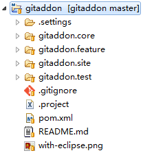
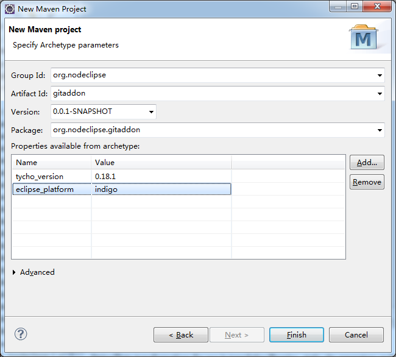

## About

Associate *.git* files with TextEditor

Builded againt Indigo and tested in Kepler.

      <editor
            class="org.eclipse.ui.editors.text.TextEditor"
            contributorClass="org.eclipse.ui.texteditor.BasicTextEditorActionContributor"
            default="true"
            extensions="gitignore,gitmodules,gitattributes"
            icon="icons/git.ico"
            id="org.eclipse.ui.DefaultTextEditor"
            name="Text Editor">
      </editor>

# Get

1. In Eclipse import.. Git
2. as New general project 
3. right-click import Existing Maven projects

## Install from sources

1. `mvn package`  
2. `npm install http-server -g`  
3. `http-server gitaddon.site\target\repository`
4. start http://localhost:8080/  
5. // navigate `http://localhost:8080/` in browser to check  
5. Help->Install New Software, enter http://localhost:8080/ in Work With  

Run offline if to re-build
`mvn -o package`

## Created

Created with Open-Archetypes

http://code.google.com/p/open-archetypes/

`mvn archetype:generate -DarchetypeCatalog=http://open-archetypes.github.io/maven-repo/snapshots/`

or with Eclipse

read https://github.com/open-archetypes/tycho-eclipse-plugin-archetype

Please be careful [if you use Nexus](https://github.com/open-archetypes/tycho-eclipse-plugin-archetype/issues/5)

For `kepler` update `MANIFEST.MF` as below in `.test` project (see [#3](https://github.com/open-archetypes/tycho-eclipse-plugin-archetype/issues/3))
`Require-Bundle: org.eclipse.jdt.junit4.runtime;bundle-version="1.1.0",
 org.junit;bundle-version="4.11.0"`

MIT License was chosen at <http://choosealicense.com/> 

## Other 

Not used here, but you also may be interested in
 [A Maven Archetype for Hadoop Jobs](http://blog.mafr.de/2010/08/01/maven-archetype-hadoop/)
 
### Other links
 
 - http://stackoverflow.com/questions/12402860/eclipse-ctrlspace-content-assist-hook
 - http://stackoverflow.com/questions/1103199/eclipse-plugin-editor
 
 
